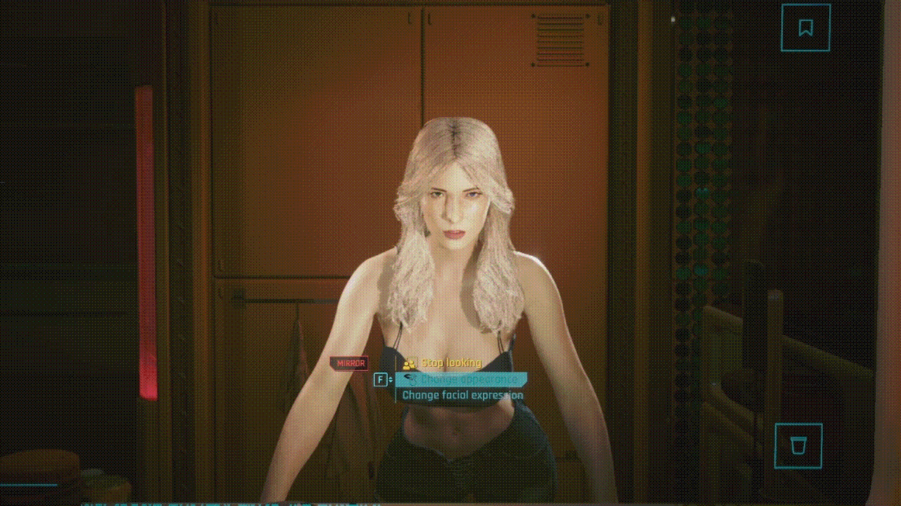

<h1 align="center">Character Preset Manager (CET)</h1>

<p align="center"><em>Save, load, organize, recover, and share complete Cyberpunk 2077 character appearances.</em></p>

<p align="center">
  <strong><a href="https://www.nexusmods.com/cyberpunk2077/mods/31886">Download on Nexus Mods</a></strong>
  · <a href="https://discord.com/invite/mUGHmQxHG8">Discord and support</a>
  · <a href="https://github.com/DKLYNTLY/Character-Preset-Manager-CET-">GitHub source</a>
</p>

<p align="center"><strong>Current version: 3.1.0</strong></p>

Character Preset Manager is the successor to Appearance Change Unlocker (ACU).
It carries ACU preset collections forward and expands the idea into a complete
appearance library with safer loading, folders, compatibility checks, recovery,
sharing, backups, and clear activity records.

The mod has two interfaces. Use the simple panel inside Cyberpunk's character
screens for quick saving and one-click loading. Open the complete manager in the
Cyber Engine Tweaks overlay when you want every feature or need a dependable
fallback.

> [!IMPORTANT]
> Remove **Character Customization Anywhere** before using this mod. ACU preset
> files are supported in 3.1.0, but use Character Preset Manager's controls to
> load the imported copies. Do not start a second load from ACU at the same time.

> [!NOTE]
> **Future Cyberpunk versions:** the simple character-screen panel is connected
> directly to the game's interface and may need an update after a major game
> patch. The complete CET manager will remain the backup interface for saving,
> loading, organizing, and recovering presets while the simple panel is being
> updated. Open the CET overlay and choose **Character Preset Manager**. CET and
> the other required frameworks must also support the new game version.

## Choose the interface you need

| Interface | Best for | After a major game update |
|---|---|---|
| **Simple character-screen panel** | Quick saving, searching, loading, Refresh, recovery, and Trash | May need a compatibility update if Cyberpunk changes its character-screen interface |
| **Complete CET manager** | Every preset feature, detailed checks, folders, sharing, backups, logs, Help, and permanent deletion | Use this as the backup when the simple panel is unavailable |

Both interfaces use the same preset library and loading engine. A missing simple
panel does not mean your presets were deleted.

## Features

- **Complete appearance presets** — Save and load every visible vanilla, CC,
  and CCXL character option available in the active editor.
- **Native character-screen panel** — Browse, refresh, load, recover, save, and
  move presets to Trash from new-game creation, the Full Appearance Editor,
  apartment mirrors, and supported ripperdoc screens.
- **Full Appearance Editor anywhere** — Open Cyberpunk's full character editor
  during normal play from CET or an optional key.
- **Full apartment mirrors** — Use the complete character-creation option list
  through ordinary apartment mirrors.
- **One-click loading** — Select a preset once and let the mod handle editor
  refreshes, dependent choices, cleanup, and final verification.
- **Detailed comparison** — Check matching, changing, missing, repeated or
  uncertain, invalid, and extra options before loading when you want a review.
- **Safer appearance cleanup** — Clear old dependent and leftover choices so
  settings such as heterochromia or separate eye colors do not remain stuck
  from the previous preset.
- **Five-entry appearance history** — Recover an earlier appearance, with a new
  safety snapshot created before restoring an older entry.
- **Unlimited CET folders** — Organize presets in folders and nested folders
  without creating matching Windows folders.
- **Search, favorites, notes, and tags** — Find and label presets without
  changing their appearance data.
- **Readable format-8 files** — Keep names, folders, dates, details, and saved
  choices in plain text while retaining support for older CPM and compatible
  ACU presets.
- **Automatic ACU imports** — Copy new or updated ACU presets into a separate
  `ACU Presets` folder after startup or when you select **Refresh**.
- **Successor to ACU** — Keep compatible ACU 3.0.0, 3.0.1, and 3.2.1 preset
  collections while moving to one maintained manager and current preset format.
- **Sharing and backups** — Send one preset, export a complete folder, combine
  selected presets, or protect the entire library in one backup.
- **Recoverable Trash** — Restore presets and folder groups before choosing the
  separate permanent-deletion action.
- **Activity Log and searchable Help** — Review results in plain language and
  find instructions without leaving CET.

## What changed in 3.1.0

- **Focused ACU import service** — A small RED4ext service checks ACU's preset
  folder once after startup. A background folder watcher detects later changes,
  and **Refresh** remains available if the watcher is unavailable.
- **Three ACU layouts supported** — Load the JSON layout used by ACU 3.0.0,
  the renamed JSON fields used by 3.0.1, and the text or JSON presets supported
  by 3.2.1.
- **No repeated copies** — The importer checks each safe file name, size, and
  modified date against its saved import record before opening the file.
- **Smooth, lazy library updates** — New imports enter the CET library as
  lightweight records, two per frame. Full contents stay unread until a preset
  is selected, checked, or loaded. Character-screen initialization does not
  open preset files.
- **Dangerous ACU options are reported** — When an imported preset is checked,
  the Activity Log names saved options such as internal eye locks that the game
  marks inactive or not editable. The preset remains imported and unchanged.
  This warning does not change loading.

## What changed in 3.0.9

- **Smoother editor opening** — The character-screen preset panel now prepares
  preset file details a few at a time after the character screen appears. This
  avoids reading the full preset library while Cyberpunk is building the editor.
- **No feature loss** — Search, favorites, tags, selected-preset details, and
  the rest of the character-screen panel become available as soon as that short
  preparation finishes.

## What changed in 3.0.8

- **Expanded character-screen panel** — Refresh the library and view the
  selected preset's folder, option count, format, and tags without making the
  panel wider.
- **Clearer section layout** — Centered labels, improved spacing, and thin
  dividers separate Search, presets, selected details, load controls, status,
  and save controls. The title and Panel Status remain left-aligned.
- **Faster recovery controls** — **Undo Last Load** restores the newest saved
  appearance. **Recovery History** shows up to five older entries in the preset
  list area.
- **Reliable load cancellation** — **Cancel Load** stays above the recovery
  controls, works on the first press, and immediately changes to **Canceling
  Load...** while the request finishes.
- **Simpler saving** — **Save Preset** changes from red to cyan after a name is
  entered. **Save Location** opens a scrollable folder picker instead of
  cycling through every folder.
- **Short results with full details available** — Panel Status gives a compact
  result. **View Load Details in CET** opens the matching advanced section when
  more information is available.
- **Cached panel data** — Prepared preset and save-location rows remain cached
  until their source changes. History is read only when requested, and editor
  options are checked only during a load or recovery action.

See [CHANGELOG.md](CHANGELOG.md) for the complete release history.

## Interface previews

### Character customization screen


The character-screen panel provides Search, one-click loading, selected-preset
details, load cancellation, recovery history, quick saving, recoverable Trash,
and access to the advanced CET manager.

### Advanced CET menu


The CET window keeps the complete library in one place. Its sections cover
loading, saving, folders, bulk actions, sharing, backups, Trash, settings, the
Activity Log, and searchable Help.

### Full apartment mirror options



Apartment mirrors show the full set of character-creation options instead of
the smaller selection normally available during play.

---

<details>
<summary><strong>Requirements and installation</strong></summary>

## Requirements

Install the following versions or newer:

- [Cyber Engine Tweaks 1.37.1](https://www.nexusmods.com/cyberpunk2077/mods/107)
- [RED4ext 1.30.0](https://www.nexusmods.com/cyberpunk2077/mods/2380)
- [redscript 0.5.31](https://www.nexusmods.com/cyberpunk2077/mods/1511)
- [Codeware 1.20.3](https://www.nexusmods.com/cyberpunk2077/mods/7780)

## Installation

1. Download the latest release from
   [Nexus Mods](https://www.nexusmods.com/cyberpunk2077/mods/31886).
2. Install the four requirements listed above.
3. Remove Character Customization Anywhere if it is installed, then fully
   restart the game. ACU may remain installed when you want its preset folder
   imported, but use Character Preset Manager to load the imported copies.
4. Extract the archive into the main `Cyberpunk 2077` game folder. The included
   `bin` and `r6` folders should merge with the folders already there.
5. Start the game and open a supported character screen for the native panel.
   Open the CET overlay for the complete manager.

The CET window opens near the right side on first use. CET remembers its size
and position after you move or resize it.

## Updating from an older release

1. Back up any `.preset`, `.cpmfolder`, and `.cpmbackup` files you want to keep
   from `Character Presets`.
2. Remove the old `Character Preset Manager (CET)` mod folder.
3. Install version 3.1.0 and its current requirements.
4. Return your saved presets and sharing files to `Character Presets`.
5. Fully restart the game so the redscript panel and bridge are rebuilt.

Older CPM formats and ACU 3.0.0, 3.0.1, and 3.2.1 preset layouts remain
readable. The mod does not rewrite an old preset just because it finds or loads
it. Overwriting that preset, or saving its notes or tags, updates the file to
format 8. Keep a
backup if you may need to use the old copy with an earlier mod version.

</details>

<details open>
<summary><strong>Importing presets from Appearance Change Unlocker (ACU)</strong></summary>

## What the ACU importer does

Character Preset Manager automatically copies compatible presets from ACU's
folder into its own library. Your original ACU files are not moved, renamed, or
rewritten. Imported copies appear in the physical **ACU Presets** folder and in
the same folder inside Character Preset Manager.

The importer supports these ACU layouts:

- ACU 3.0.0 JSON presets
- ACU 3.0.1 JSON presets
- ACU 3.2.1 text and JSON presets

## Import ACU presets step by step

1. Confirm that the ACU files end in `.preset` and are stored here:

   ```text
   bin/x64/plugins/cyber_engine_tweaks/mods/AppearanceChangeUnlocker/character-presets
   ```

2. Install Character Preset Manager 3.1.0 and all four requirements.
3. Fully restart the game. The importer waits briefly after startup before it
   checks ACU's folder.
4. Open the CET overlay and choose **Character Preset Manager**.
5. Look for the **ACU Presets** folder in the preset list.
6. If the files are not shown yet, select **Refresh** once and wait a moment.
7. Select an imported preset and use **Check Compatibility** when you want to
   review it before loading.
8. Load the imported copy through Character Preset Manager. Do not start a
   second load from ACU at the same time.

After the copies appear, removing ACU does not remove them from Character Preset
Manager. Keep your original files until you have checked the imported copies and
made a separate backup.

## Where imported presets are stored

Imported copies are written here:

```text
bin/x64/plugins/cyber_engine_tweaks/mods/Character Preset Manager (CET)/Character Presets/ACU Presets
```

ACU subfolders are preserved. New or changed source files are copied again when
needed. Unchanged files are skipped, so they are not repeatedly copied whenever
you open a menu.

## If ACU presets do not appear

Check these items in order:

1. Make sure the source folder is named exactly `AppearanceChangeUnlocker` and
   contains the `character-presets` folder shown above.
2. Make sure each file ends in `.preset`, is not empty, and is no larger than
   1 MB.
3. Confirm that RED4ext and the other required frameworks are installed and
   support your Cyberpunk version.
4. Fully restart the game. Reloading a save is not the same as restarting.
5. Open the CET manager and select **Refresh** once.
6. Open **Log** and look for an **ACU IMPORT** or **ACU SAFETY** message. Include
   that message when asking for help.

An imported preset may contain an internal option, such as an eye-lock field,
that the game marks inactive or not editable. Character Preset Manager keeps the
preset unchanged and records the exact option in the Activity Log. The warning
does not reject the imported file or change loading.

</details>

<details>
<summary><strong>Optional keys and supported screens</strong></summary>

## Optional keys

1. Open CET and select **Bindings**.
2. Find **Character Preset Manager (CET)**.
3. Assign **Open Full Appearance Editor** if you want to open the editor with a
   key during play.
4. Assign **Toggle Character Preset Manager (CET)** if you also want a direct
   key for the CET window.
5. Close the CET overlay before using the editor key.

Help shows assigned keys when CET provides them. If CET cannot display a key,
Help reports whether that input was used during the current game session.

## Supported character screens

Saving and loading work in new-game character creation, the Full Appearance
Editor, apartment mirrors, and supported ripperdoc appearance editors. The
native panel appears inside these screens and the CET window can control the
same active editor.

Photo Mode and Appearance Menu Mod may stay installed, but their own menus do
not expose the normal character editor data required by Character Preset
Manager. Open one of the supported screens before saving, loading, comparing,
or restoring an appearance.

</details>

<details>
<summary><strong>Quick interface: using the simple character-screen panel</strong></summary>

## Using the simple character-screen panel

Select a preset once to load it. Folder rows open and close their contents,
Favorites remain near the top, and presets outside folders appear under **All
Presets**. Use Search to filter the visible library, or select **Refresh** after
adding or changing preset files outside the game. The selected-preset card shows
the folder, saved-option count, file format, and tags.

Select **Undo Last Load** to restore the newest recovery appearance. Select
**Recovery History** to replace the preset rows with up to five recovery
entries, newest first. Choose an entry to restore it, or select **Back** to
return to the preset library. The mod saves the current appearance before it
restores an older entry.

To save, enter a name in **Preset Name**, choose **Save Location**, and select
**Save Preset**. Save Location opens a scrollable folder picker in the preset
list area. Choose **All Presets** or a folder, then save normally. If the name
already exists, the same button changes to **Confirm Overwrite**. Select it
again only when you intend to replace the existing preset.

Panel Status gives a short loading result. A normal result confirms how many
saved options were checked. If some choices could not be confirmed, select
**View Load Details in CET** to open the advanced Load section and review the
complete message. While a preset or recovery appearance is loading, select
**Cancel Load** if you need to stop before it finishes.

Select a preset before using **Move Preset to Trash**. The same button changes
to **Confirm Move to Trash** for the second press. Restoration and permanent
deletion remain in CET so those actions cannot be confused with the quick panel
control.

**Advanced Preset Manager** does not open the overlay by itself. After pressing
it, use your CET binding and choose **Character Preset Manager** from the menu
on the right. The CET window contains comparison, renaming, notes, tags,
favorites, folder management, sharing, backups, permanent deletion, settings,
logs, and Help.

</details>

<details>
<summary><strong>Complete CET manager: saving, loading, and compatibility checks</strong></summary>

## Saving a preset in CET

1. Open a supported character screen.
2. Open Character Preset Manager in CET.
3. Check the save location shown in the status card.
4. Open **Change Save Location** when you want a different folder or **All
   Presets**.
5. Enter a name and select **Save New Preset**.

If the name is already in use, select **Replace Existing Preset** only when you
want to overwrite it. The mod records the visible editor options and saves the
new preset in format 8.

## Loading a preset in CET

1. Open a supported character screen.
2. Choose a preset under **Load & Restore Appearance**.
3. Review its name, folder, format, and saved-option count.
4. Select **Load Selected Preset** once.
5. Wait for the final status. A successful result confirms every saved option;
   a warning names anything Cyberpunk could not confirm.

Cyberpunk may refresh the editor several times. Character Preset Manager waits
for dependent options to appear, continues automatically, clears genuine
leftovers, rebuilds the visible option list, and performs a final read-only
check. Use **Cancel Loading** only when you need to stop the process.

Loading stops safely when the same required options remain missing after three
checks. Missing choices usually mean an option mod, version, body or eye choice,
or load order changed after the preset was created. Correct the appearance and
save it again with the current setup.

## Checking compatibility

Compatibility checks are manual so large CC and CCXL lists are not repeatedly
scanned while you browse. Choose a preset, open **Preset Options**, and select
**Check Compatibility**. The result separates options that already match,
options that will change, missing choices, repeated or uncertain matches,
invalid data, and extra options that loading will clear.

Selecting a preset, opening CET, refreshing the library, changing **Force Full
Load**, or finishing a load does not automatically start another comparison.
Run a new check whenever you want a result for the editor's current state.

## Force Full Load

Current format-8 presets normally use their saved editor slot and stable choice
name. **Force Full Load** allows less certain position-based matching when an
older preset does not contain enough detail. It turns on automatically for old
formats that need it and turns off when you select a current preset. You can
change it under **Load & Restore Appearance > Preset Options**.

Use this option carefully after adding, removing, or reordering character mods.
An older file knows less about the original choice, so a shifted hairstyle or
color list may point to a different item. Correct the result once and save the
preset again in format 8.

</details>

<details>
<summary><strong>Appearance history and preset files</strong></summary>

## Appearance history and recovery

Before each normal preset load, Character Preset Manager saves the current
appearance for recovery. Up to five different entries are kept. Identical
snapshots are skipped, and restoring an older entry creates a fresh safety
snapshot first.

Open **Load & Restore Appearance** in a supported character screen to restore
the newest previous appearance or choose an entry from Appearance History.
History is separate from the normal preset library and is stored under
`Data/Recovery/Appearance History`.

## What a preset saves

Format 8 records every visible option, the option's editor position, its saved
choice when a stable name exists, and its number in the choice list. It can also
store the preset name, CET library folder, source, creation and modification
dates, notes, tags, and favorite state.

The extra details help a preset survive list changes introduced by CCXL and
other option mods. A renamed option can still match when its editor slot and
unique saved choice agree. Always check the final appearance after changing
character-option mods, versions, body or eye choices, or load order.

## Readable format-8 files

Current presets use plain headings instead of encoded text. Each appearance
entry keeps its original option key and saved number, followed by labeled
details when they are available.

```text
# CPM Preset
# Format: 8
# Name: Neon Street V
# Source: Character Preset Manager (CET)
# Created: 2026-08-15 13:19:27
# Modified: 2026-08-15 13:19:27
# Notes:
# Tags:
# Favorite: No
# Library folder: Favorites/Female V

LocKey#9502141975964618858:50
# Editor slot: hairstyle
# Saved choice: options:51
```

Normal comment lines are ignored while reading. `CPM Preset` identifies a file
saved by this mod. `Name` and `Library folder` allow the catalog to rebuild a
missing folder-list entry. `/` means **All Presets**.

</details>

<details>
<summary><strong>Preset files and organization</strong></summary>

## Preset location and sharing one preset

Preset files and exported files are stored here:

```text
bin/x64/plugins/cyber_engine_tweaks/mods/Character Preset Manager (CET)/Character Presets
```

Send a preset's `.preset` file to share one appearance. To install one, place it
in `Character Presets` or a normal Windows folder inside that location, then
select **Refresh** under **Load & Restore Appearance**. A single preset file
does not carry an older CET folder assignment; a current format-8 CPM file can
record its library folder in its readable header.

For safety, a preset cannot exceed 1 MB, 16,448 lines, or 4,096 valid options.
An option name cannot exceed 256 bytes, and an option number must fit in an
unsigned 32-bit value.

## Search, favorites, notes, and tags

Search checks preset names, folder names, and tags. Tags also appear beside
preset names. Choose a preset and open **Rename & Copy Presets > Tags, Notes &
File** to edit its optional notes or tags or copy its full path from the game
folder.

To pin a preset, open **Load & Restore Appearance > Preset Options** and select
**Add Selected Preset to Favorites**. The preset stays in its original folder
and also appears in the Favorites group. Current files store this choice in the
readable preset header.

## CET folders

Folders created in CET organize the library without creating or renaming
Windows folders. You can place folders inside other folders with no set depth
limit. The layout is stored in:

```text
Data/Catalog/Virtual Folders.txt
```

Choose the parent before creating a nested folder. Moving or renaming a preset
changes its CET location and its `.preset` filename. Copies appear beside the
original with a safe name such as `Copy` or `Copy 2`. Copying a folder also
copies every preset and nested folder inside it.

**Remove Folder, Keep Presets** removes the selected CET folder and moves its
contents to the folder above it. Nothing is permanently deleted.

## Imported Windows folders

Character Preset Manager also finds normal Windows folders placed inside
`Character Presets`, including nested folders. These entries carry an
**Imported** label. Renaming or moving them in CET changes the library layout
without renaming the Windows folder.

When you remove an Imported folder but keep its presets, known `.preset` files
move to the main preset folder first. A Windows folder is removed only after it
is confirmed empty. Unknown files are never deleted, and a folder containing
one remains in place. Linked folders and Windows junctions are not supported.
The safety scan stops when an entry cannot be confirmed or when a physical
folder is more than 12 levels deep.

</details>

<details>
<summary><strong>Sharing and backups</strong></summary>

## Sharing a complete folder

A `.cpmfolder` file contains one CET folder, every nested folder, and all
presets in that group. Notes, tags, favorites, and other supported preset
details are included.

### Export a folder

1. Open **Create & Organize Folders** and select a non-empty folder.
2. Open **Share & Import Folders**.
3. Select **Export Selected Folder as a .cpmfolder File**.
4. Find the new file in `Character Presets` and send that one file.

A shared folder can contain up to 512 presets and cannot exceed 32 MB. Empty
folders cannot be exported. The mod writes large bundles one preset at a time
instead of keeping the complete group in memory.

### Preview and import a folder

Use **Manage & Remove .cpmfolder Files** to inspect a bundle before installing
it. The preview lists its main folder, nested folders, and presets without
changing the library.

To install it, place the file in `Character Presets`, open **Create & Organize
Folders > Share & Import Folders**, and select **Install .cpmfolder Files from
Character Presets**. The source file stays in place after a successful import.

The mod remembers the filename, contents, and installed folder in
`Data/Catalog/Imported Bundles.txt`. An unchanged bundle is skipped while its
imported folder still exists. A changed file can be imported again, and name
conflicts receive a safe `Copy` name. A failed import is not marked complete.

Moving a `.cpmfolder` source file to Trash does not remove the folder or presets
already installed from it.

## Exporting selected presets

Open **Select & Manage Multiple Presets**, choose presets from any folders, and
select **Export Selected**. The new `.cpmfolder` file preserves their paths
inside one **Selected Presets** group when it is installed.

## Complete-library backups

Open **Export & Import Backups** and select **Export Complete Library Backup**.
The resulting `.cpmbackup` file contains every preset, the CET folder layout,
and current settings. It appears in `Character Presets`.

To restore one, choose its filename under **Backup File** and select **Import
Selected Library Backup**. An empty installation receives the original layout.
When names are already in use, the imported content goes into a safe **Imported
Library** folder instead of overwriting anything. A backup cannot exceed
256 MB.

**Delete Selected Backup Permanently** removes only the chosen `.cpmbackup`
file. It does not delete presets already installed in the library. Confirm the
displayed filename before using the permanent action.

</details>

<details>
<summary><strong>Bulk actions, Trash, and recovery</strong></summary>

## Bulk actions

**Select & Manage Multiple Presets** lets you build a selection from any folder
or current search result. Select a row again to remove it from the group.
**Select All Visible** and **Clear Selection** help with larger sets. The chosen
presets can be moved to one folder, exported together, or moved to Trash.

## Trash and permanent deletion

- Moving a preset or folder to Trash keeps it available for recovery.
- Folder Trash groups remember nested folders, including empty ones.
- Presets and complete folder groups can be restored from CET.
- Name conflicts receive a safe `Copy` name instead of overwriting an existing
  preset or folder.
- Imported Windows folders are removed only when confirmed empty. Unknown files
  are never deleted.
- If the game closes during Trash, restore, multi-move, or file-renaming work,
  the mod finishes or safely rolls back the action at the next startup.
- If Trash cannot be read safely, the last good list and folder information are
  kept instead of being replaced with incomplete data.
- **Empty Trash Permanently** is the only action that permanently deletes
  trashed presets and folder groups.

The native panel can move a selected preset to Trash, but restoration and
permanent deletion are available only in CET. This keeps the destructive choice
separate from the quick character-screen controls.

</details>

<details>
<summary><strong>Settings, data, and performance</strong></summary>

## Settings

**Preset Sort Order** is available in CET's **Settings** tab. It sorts the
library by name or by the date a preset was last changed. CET key assignments
remain under **Bindings**.

The settings mirror is stored at `Data/Config/Config.txt`. Changes made through
CET update it automatically. Do not edit that file while the game is running.

## Data folders

The mod keeps its catalog, settings, recovery data, Trash, and logs under
`Data`:

```text
Data/
|-- Config/
|-- Catalog/
|-- Recovery/
|   |-- Appearance History/
|   `-- Trash/
`-- Logs/
    `-- Archive/
```

## Performance and memory use

Compatibility scans run only when you request one. Preset cleanup and fresh
editor reads run only while loading, use the normal load interval, and stop
when the operation ends. The native panel polls only its small request bridge;
it does not scan the appearance list during ordinary frames.

The ACU import service checks
`AppearanceChangeUnlocker/character-presets` once after a short startup delay.
A background folder watcher signals later changes without scheduled rescans.
**Refresh** requests a check when the watcher is unavailable. The service
compares file names, sizes, and modified dates with its saved record before
reading changed files. It stages each changed file before moving it into the
library. CET adds no more than two lightweight imported records per frame and
does not open their preset contents until they are selected, checked, or loaded.
Character-screen initialization does not read preset files.

Large preset, folder, Trash, sharing, backup, preview, and Activity Log lists
use pages instead of drawing every item at once. Backup discovery and
previous-appearance availability are remembered rather than checked every
frame.

Temporary load data is released as soon as a load finishes. When the CET window
is hidden or the overlay closes, the mod also unloads full preset contents and
rebuildable interface lists. Names, folders, notes, tags, favorites, and other
library details remain ready for the next use.

</details>

<details>
<summary><strong>Compatibility and known issue</strong></summary>

## Compatibility

### Future Cyberpunk versions and the CET fallback

The simple panel is added directly to Cyberpunk's character screens. A major
game update may change those screens, so the simple panel may need a matching
Character Preset Manager update before it appears or works correctly again.

The complete CET manager is the backup interface. If the simple panel is not
ready for a new game version, open the CET overlay and choose **Character Preset
Manager**. You can continue using the same preset library, saving, loading,
folders, recovery, sharing, backups, compatibility checks, logs, and Help from
CET. Update CET, RED4ext, redscript, and Codeware to versions that support the
new Cyberpunk release first.

### CC and CCXL character-option mods

These mods are supported when their options appear in Cyberpunk's normal
character screens. Repeated and linked options, including separate eye colors,
are supported. Keep the same mods, versions, body and eye choices, and load
order used to create the preset. Review the appearance whenever that setup
changes.

### Appearance Change Unlocker

Character Preset Manager imports supported ACU files from
`AppearanceChangeUnlocker/character-presets` into the physical
`Character Presets/ACU Presets` folder. It preserves ACU subfolders and supports
the preset layouts used by ACU 3.0.0, 3.0.1, and 3.2.1. Use Character Preset
Manager's controls for the imported copy, and do not start an ACU load at the
same time. New or updated Character Preset Manager files use format 8.

### Character Customization Anywhere

Character Customization Anywhere is not compatible because it changes the same
mirrors and character screens. Remove it and fully restart the game.

### Photo Mode and Appearance Menu Mod

These mods may remain installed. Character Preset Manager cannot save or load
inside their menus, so use the Full Appearance Editor, a mirror, a supported
ripperdoc, or new-game creation.

## Known issue: loading screen after closing an editor

Cyberpunk can occasionally remain on a loading screen after any character
editor closes. This also happens without Character Preset Manager. Clothing,
wardrobe outfits, Equipment-EX, and detailed outfits may make it more likely.

If it happens, remove all clothing and select **No Outfit** before opening the
editor. Put the clothing and outfit back on afterward.

</details>

<details>
<summary><strong>Activity Log, Help, and troubleshooting</strong></summary>

## Activity Log

Select **Log** at the top of the CET window or open it from Help. The log can be
read and copied inside CET. Its file is stored here:

```text
bin/x64/plugins/cyber_engine_tweaks/mods/Character Preset Manager (CET)/Data/Logs/Activity.log
```

Each full game launch starts a new log. The previous file is archived with its
date and time, and the ten newest archives are kept. The log records startup,
bridge connections, preset actions, loading results, warnings, errors, inactive
options, and missing saved choices. **More Technical Details** contains the
developer-facing entries.

## Searchable Help

Open **Help**, enter a word or short phrase, and select **Search**. The long Help
list pauses while you type and then shows matching topics. Searches such as
`share`, `bug`, `clothing`, `ACU`, `backup`, `Trash`, and `favorite` also include
related terms.

## Troubleshooting

### The character-screen panel says the library is connecting

Wait a moment for CET to finish loading. The active appearance screen gives CET
its exact bridge and receives the preset list immediately when ready. If the
message does not change, verify all four requirements, reinstall the current
archive, and fully restart the game. A redscript change cannot be refreshed in
an existing session.

### The simple panel is missing after a Cyberpunk update

Open the CET overlay and choose **Character Preset Manager**. The complete CET
manager is the backup while the simple panel is updated for the changed game
interface. Your presets are still in the same library. Update all four required
frameworks, check for a current Character Preset Manager release, and fully
restart the game after installing updates.

### A preset reports missing choices

Confirm that the same character-option mods, versions, body and eye choices,
and load order are installed. Run **Check Compatibility** for exact details.
Correct the appearance and save a new current-format preset after changing the
setup.

### A previous option remains visible

Read the final Panel Status or Activity Log result. The current loader clears exposed
dependent choices first and verifies genuine leftovers at the end. If the log
still names an uncleared option, include the newest Activity Log when reporting
the problem.

### The CET window is not visible

Open the CET overlay and choose **Character Preset Manager** from the menu on
the right. The native **Advanced Preset Manager** button displays this
instruction but cannot open the overlay for you.

</details>

<details>
<summary><strong>Frequently asked questions</strong></summary>

## Frequently asked questions

### Is Character Preset Manager the successor to ACU?

Yes. Character Preset Manager carries compatible ACU preset collections forward
and replaces ACU's preset workflow with a maintained library, verified loading,
folders, recovery, sharing, backups, compatibility checks, logs, and two user
interfaces. Import the ACU files once, then use Character Preset Manager to load
the imported copies.

### Can older Character Preset Manager or ACU presets be used?

Yes. Older CPM formats remain readable. ACU 3.0.0 camel-case JSON, ACU 3.0.1
snake-case JSON, and ACU 3.2.1 text and JSON layouts are supported. New presets
and files updated by this release use format 8.

### What happens if the CET folder list loses an entry?

A format-8 CPM preset records its own name and library folder. The catalog can
use those lines to rebuild the missing entry. `/` means **All Presets**. Older
files remain loadable but do not contain the same recovery details.

### Is the character shown in the screenshots included?

No. The screenshots demonstrate the mod. My personal character preset is not
included, and I do not plan to release it.

</details>

## AI disclosure

I used AI to help plan, write, and review parts of the interface, Lua,
redscript, documentation, and release checks. I made the final design and
release choices and reviewed the finished work before publishing it.

## Credits

I created and maintain Character Preset Manager as **dklyntly**.

[ACU - Character Preset Manager](https://www.nexusmods.com/cyberpunk2077/mods/3850)
by **PotatoOfDoom** is the predecessor to this project. I built Character Preset
Manager as its successor and kept support for compatible ACU presets so existing
collections are not lost. My current format, code, interfaces, loading system,
and controls are separate implementations.

[Character Customization Anywhere](https://www.nexusmods.com/cyberpunk2077/mods/3930)
by **keanuWheeze** inspired my Full Appearance Editor.

[Cyber Engine Tweaks](https://www.nexusmods.com/cyberpunk2077/mods/107) was
created by **yamashi** and is maintained by its contributors. Character Preset
Manager uses CET's scripting and menu system. RED4ext, redscript, and Codeware
provide the tools used by the native character-screen panel.

I also credit CD Projekt Red for Cyberpunk 2077 and its character system, and I
appreciate the testing, research, compatibility information, and feedback shared
by the Cyberpunk 2077 modding community.

## Links

[Download on Nexus Mods](https://www.nexusmods.com/cyberpunk2077/mods/31886) ·
[GitHub source](https://github.com/DKLYNTLY/Character-Preset-Manager-CET-) ·
[Discord and support](https://discord.com/invite/mUGHmQxHG8) ·
[Full changelog](CHANGELOG.md) · [MIT license](LICENSE)
